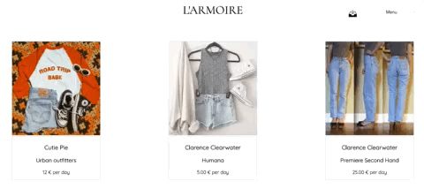
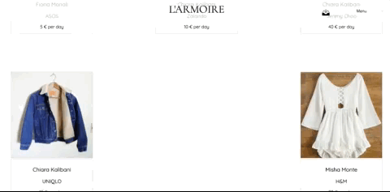
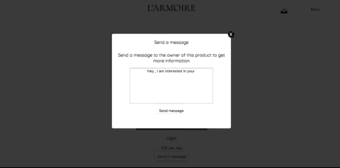
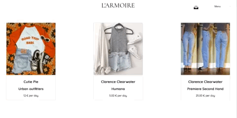
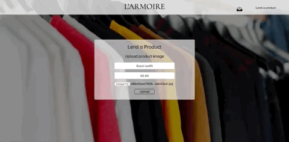

# L'ARMOIRE

## Summary
L'ARMOIRE (the wardrobe) is an online service that provides fashion rentals.
the concept of this application is to rent or lend clothes from/to other users, whether it's for investing in valuable clothes or renting clothes for special occasions.
Users would be communicating and discussing about the chosen product through direct messages to also agree on the pick up information.

## Tech Stack
* React
* Express.js on Node.js
* PostgresSQl database

## Features
* Welcome page has got parallax effect and some inspirational looks

* The website includes user registration and user login as well as logout.

* After logging in, the user can see the homepage that contains all the products that are offered for rental with the brand and the price

* The user can click on the chosen product for a bigger image and for contacting the owner

* A message container pops up to send the message

* Afterwards the owner can check their inbox for messages and reply to it

* The user can also upload an image of their own products with required information that gets uploaded to the top of the homepage

